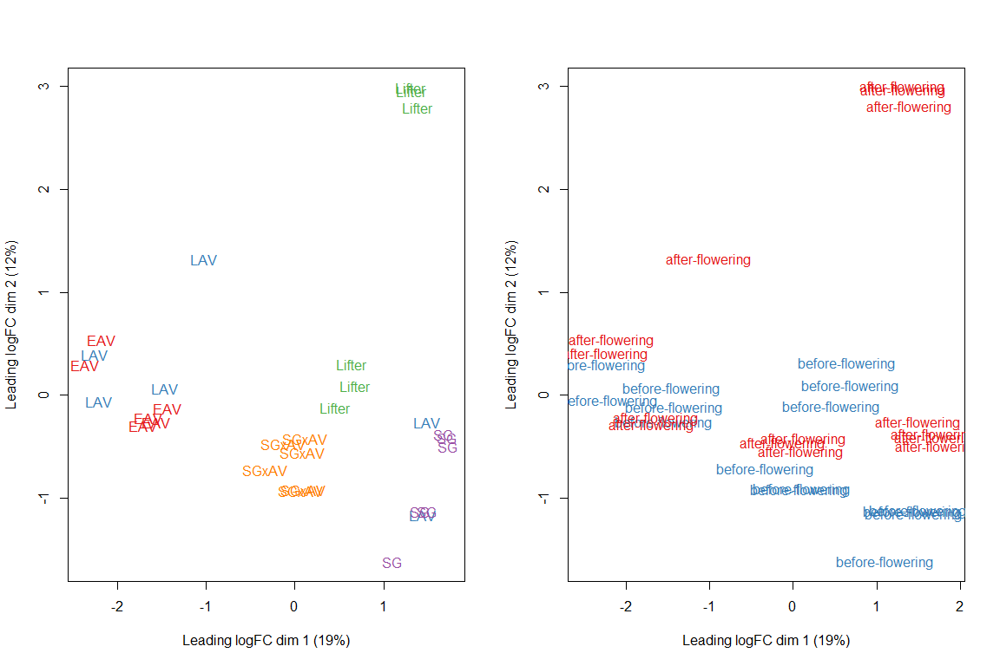
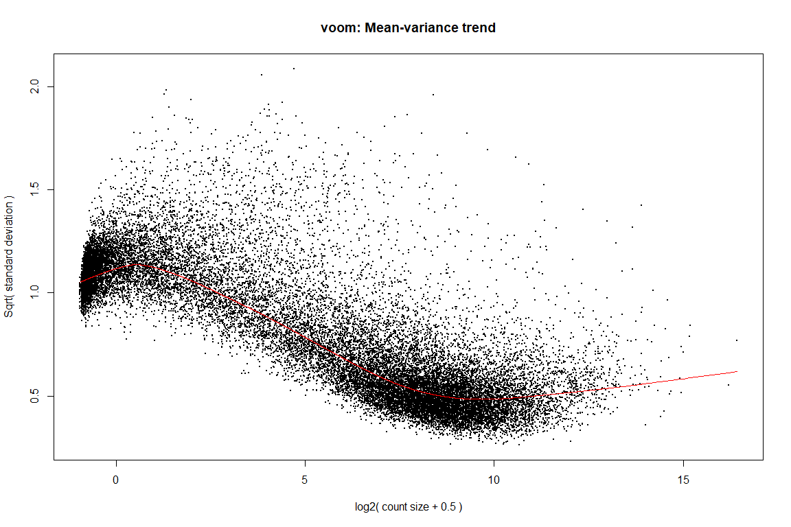
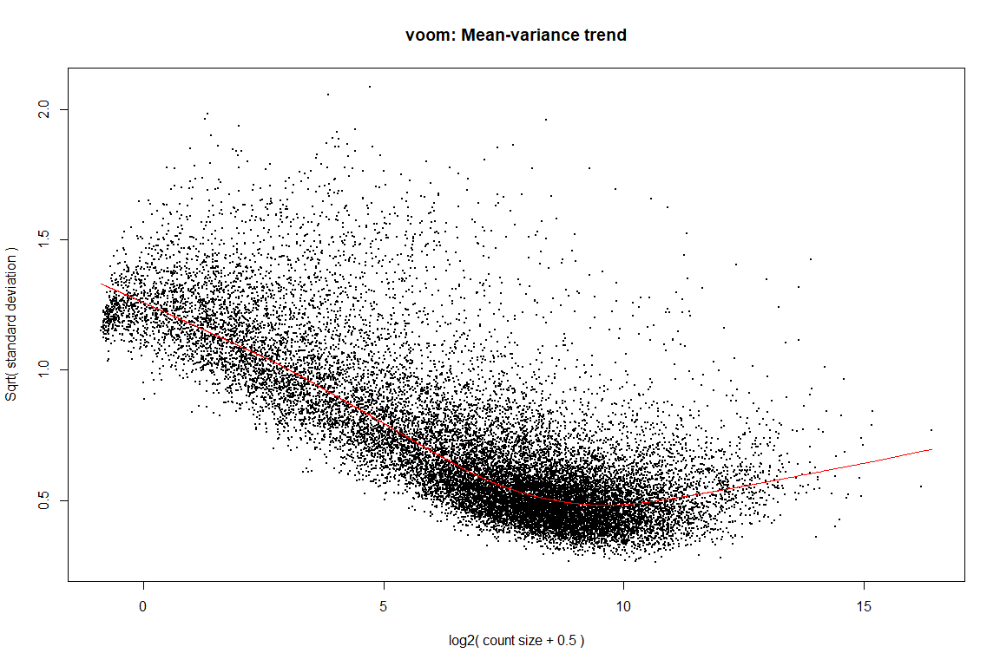
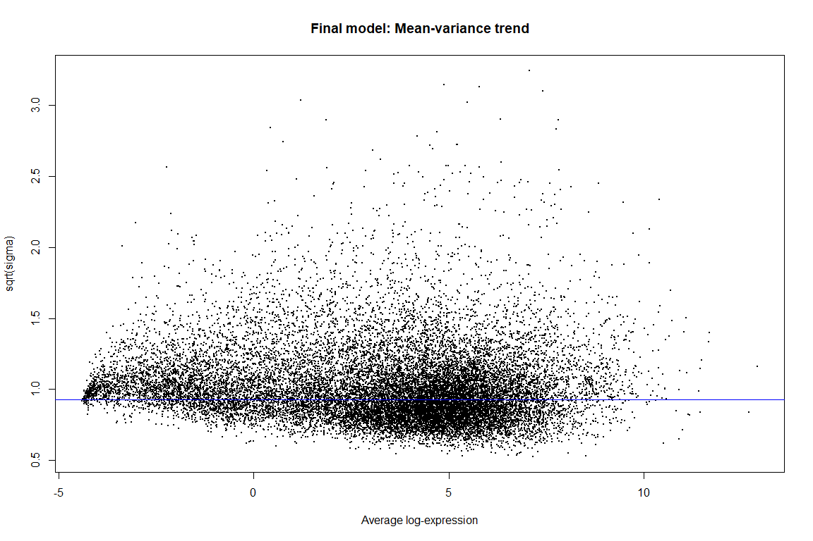
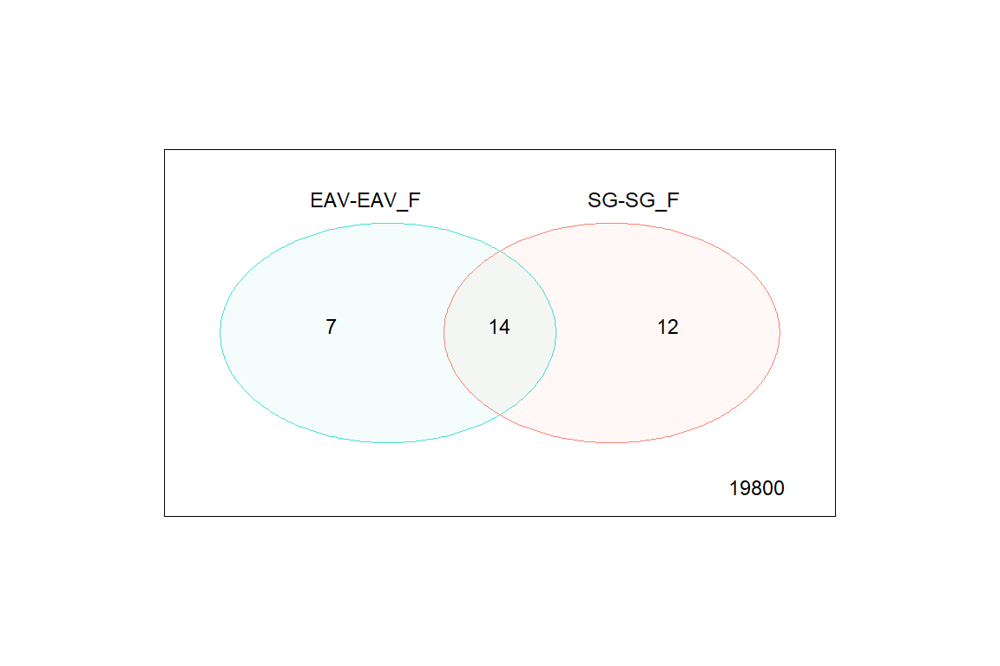
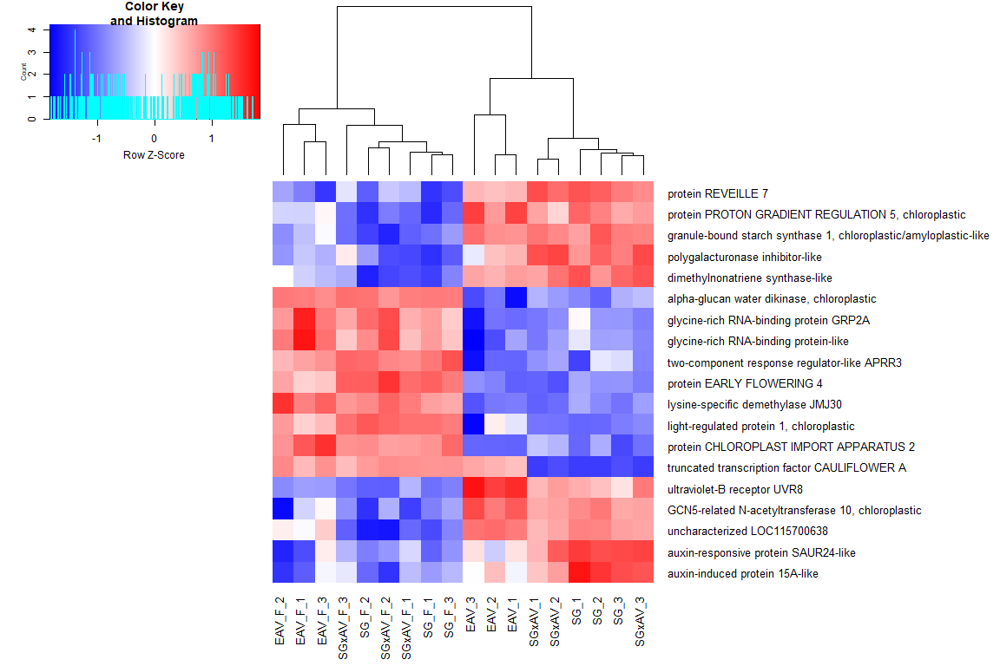
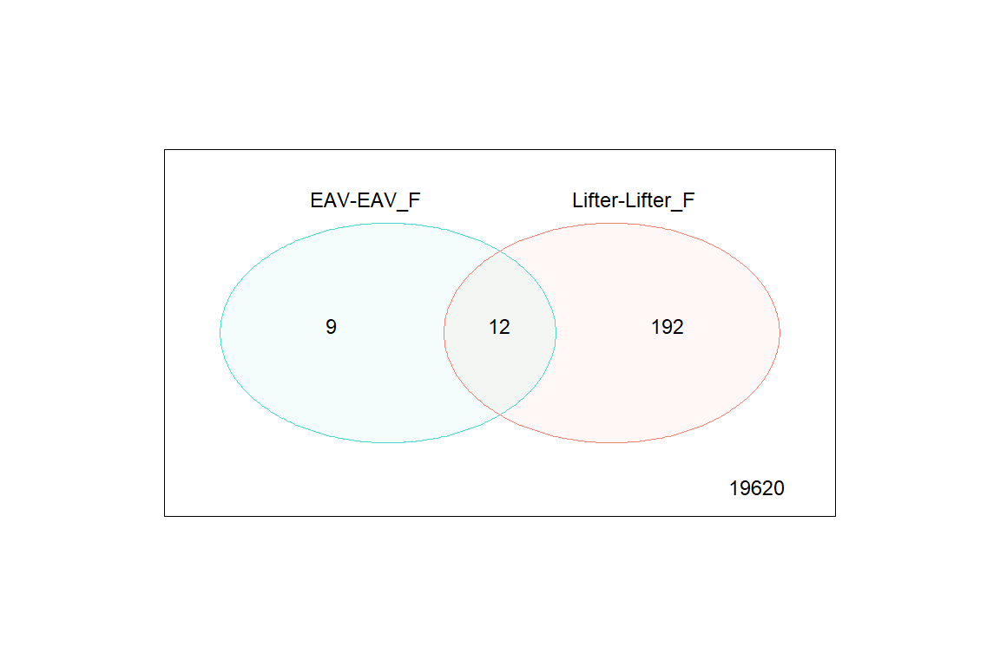
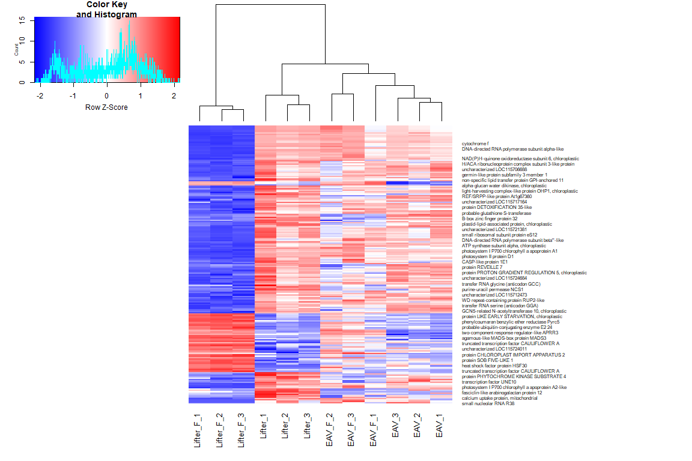

Differential gene expression analysis
================
JG
2026-01-25

## Purpose

- A case study using 30 RNA-seq sample data.

1.  Check overal sample variation using normalized read count
2.  Filter for heterogeneity in the data
3.  Pair-wise t-test for fold change before and after flowering
4.  Cluster progeny and parental samples using reads from selected genes

## Data and links

Base on data in `2024Jun-RNASeq`

## Results and conclusions

1.  Overall good sample variation among treatments
2.  Identify 19 DGEs that is unique to SG and EAV parental genotypes
3.  Cluster result indicates progeny genotype (SGxAV) are more similar
    to the photoperid sensitive parent (SG)

### Import data

``` r
# ------------------- import data --------------- #
DGE_norm <- readRDS('/Users/neoji/Dropbox/Hemp/2024Jun-RNASeq/2024Jun-RNASeq/Gene counts/rRNA-filtered_and_normalized_DGEList.rds')
mdt <- DGE_norm$samples

files <- paste0('/Users/neoji/Dropbox/Hemp/2024Jun-RNASeq/2024Jun-RNASeq/Gene counts/raw gene counts/', dir('/Users/neoji/Dropbox/Hemp/2024Jun-RNASeq/2024Jun-RNASeq/Gene counts/raw gene counts/'))
DGE_raw <- readDGE(files, sep = ' ')

my_obj <- import("/Users/neoji/Dropbox/Hemp/2024Jun-RNASeq/2024Jun-RNASeq/GCF_029168945.1_ASM2916894v1_genomic.gtf.gz")
class(my_obj)
```

    ## [1] "GRanges"
    ## attr(,"package")
    ## [1] "GenomicRanges"

``` r
dt_GTF <- data.table::as.data.table(my_obj@elementMetadata@listData)
```

### Check overall sample DGE variation

``` r
# ------------ Check overall sample variation using plotMDS ------------ #
lcpm <- cpm(DGE_norm, log=TRUE)
par(mfrow=c(1,2))
group <- DGE_norm$samples$group
cultivar <- DGE_norm$samples$cultivar
col.group <- as.factor(cultivar)
levels(col.group) <-  brewer.pal(nlevels(col.group), "Set1")
col.group <- as.character(col.group)
plotMDS(lcpm, labels=cultivar, col=col.group)

sampling_stage <- DGE_norm$samples$growth.stage
col.group <- as.factor(sampling_stage)
levels(col.group) <-  brewer.pal(nlevels(col.group), "Set1")
```

    ## Warning in brewer.pal(nlevels(col.group), "Set1"): minimal value for n is 3, returning requested palette with 3 different levels

``` r
col.group <- as.character(col.group)
plotMDS(lcpm, labels=sampling_stage, col=col.group)
```

<!-- -->

### Filter for outlier data

``` r
# ------------ filter out extremely skewed data ------------- #
design <- model.matrix(~0+group)
colnames(design) <- gsub("group", "", colnames(design))
colnames(design)
```

    ##  [1] "EAV"      "EAV_F"    "LAV"      "LAV_F"    "Lifter"   "Lifter_F"
    ##  [7] "SG"       "SG_F"     "SGxAV"    "SGxAV_F"

``` r
cutoff <- 1
drop <- which(apply(cpm(DGE_norm), 1, max) < cutoff)
DGE_norm_filtered <- DGE_norm[-drop,] 
dim(DGE_norm_filtered) # number of genes left
```

    ## [1] 19833    30

``` r
v0 <- voom(DGE_norm, design, plot=TRUE)
```

<!-- -->

``` r
v1 <- voom(DGE_norm_filtered, design, plot=TRUE)
```

<!-- -->

### Model pair-wise constrasts

``` r
# ------------ contrast individual groups ---------- #
v_filter <- voom(DGE_norm_filtered, design, plot=F)
vfit_filtered <- lmFit(v_filter, design)
colnames(coef(vfit_filtered))
```

    ##  [1] "EAV"      "EAV_F"    "LAV"      "LAV_F"    "Lifter"   "Lifter_F"
    ##  [7] "SG"       "SG_F"     "SGxAV"    "SGxAV_F"

``` r
# -------- pair-wise contrasts ------- #
design.pairs <- function(levels) {
    n <- length(levels)
    design <- matrix(0,n,choose(n,2))
    rownames(design) <- levels
    colnames(design) <- 1:choose(n,2)
    k <- 0
    for (i in 1:(n-1))
      for (j in (i+1):n) {
        k <- k+1
        design[i,k] <- 1
        design[j,k] <- -1
        colnames(design)[k] <- paste(levels[i],"-",levels[j],sep="")
      }
    design
  }

par(mfrow=c(1,1))
contr.matrix <- design.pairs(colnames(coef(vfit_filtered)))
```

### Detect significant DGEs

``` r
# using eBayes method to detect DGE
efit <- eBayes(contrasts.fit(vfit_filtered, contrasts=contr.matrix))
plotSA(efit, main="Final model: Mean-variance trend")
```

<!-- -->

``` r
# using fold-change t-test method to detect DGE
tfit <- treat(contrasts.fit(vfit_filtered, contrasts=contr.matrix), lfc=1)
# let's test using a strict 'treat' method for now

comb_treats <- colnames(contr.matrix)

ls.top.treat <- list()
for (i in comb_treats) {
  ls.top.treat[[i]] <- topTreat(tfit, coef=i, n=Inf)
}

ls.top.table <- list()
for (i in comb_treats) {
  ls.top.table[[i]] <- topTable(efit, coef=1, sort.by = "P", n = Inf)
}

head(ls.top.table[['EAV-EAV_F']], 5)
```

    ##                  logFC  AveExpr         t      P.Value    adj.P.Val        B
    ## LOC115705224  5.679668 5.148297  17.53319 5.243649e-15 1.039973e-10 21.92512
    ## LOC115714162 -3.517986 5.726175 -16.02583 3.714215e-14 3.683201e-10 21.76075
    ## LOC115711591 -2.205082 6.085405 -14.61660 2.677618e-13 1.770174e-09 20.22029
    ## LOC133029979 -3.683898 4.396923 -12.73791 4.803308e-12 2.381600e-08 16.33911
    ## LOC115715031 -1.767273 7.092792 -11.76151 2.454810e-11 9.737248e-08 16.00988

``` r
sum(ls.top.table[['EAV-EAV_F']]$adj.P.Val < 0.05)
```

    ## [1] 218

``` r
head(ls.top.treat[['EAV-EAV_F']], 5)
```

    ##                  logFC  AveExpr          t      P.Value    adj.P.Val
    ## LOC115705224  5.679668 5.148297  14.446183 1.718644e-13 3.408587e-09
    ## LOC115714162 -3.517986 5.726175 -11.470428 2.034645e-11 2.017656e-07
    ## LOC133029979 -3.683898 4.396923  -9.280182 1.245290e-09 8.232612e-06
    ## LOC115711591 -2.205082 6.085405  -7.988006 1.869984e-08 9.271849e-05
    ## LOC115702321 -5.053284 2.261226  -7.783113 2.934022e-08 1.163809e-04

``` r
sum(ls.top.treat[['EAV-EAV_F']]$logFC > 1)
```

    ## [1] 776

## Select a case to compare

### detect SGxAV progeny variation

``` r
# ----------- select a pair to find DE gene candidates -------------- #
dt <- decideTests(tfit)
summary(dt)
```

    ##        EAV-EAV_F EAV-LAV EAV-LAV_F EAV-Lifter EAV-Lifter_F EAV-SG EAV-SG_F
    ## Down          15       4        57         21          412      7       61
    ## NotSig     19812   19827     19701      19812        19036  19820    19727
    ## Up             6       2        75          0          385      6       45
    ##        EAV-SGxAV EAV-SGxAV_F EAV_F-LAV EAV_F-LAV_F EAV_F-Lifter EAV_F-Lifter_F
    ## Down           7          43         4           4           10            145
    ## NotSig     19818       19756     19813       19820        19820          19444
    ## Up             8          34        16           9            3            244
    ##        EAV_F-SG EAV_F-SG_F EAV_F-SGxAV EAV_F-SGxAV_F LAV-LAV_F LAV-Lifter
    ## Down          9          4          14             4        15          9
    ## NotSig    19802      19822       19791         19821     19803      19824
    ## Up           22          7          28             8        15          0
    ##        LAV-Lifter_F LAV-SG LAV-SG_F LAV-SGxAV LAV-SGxAV_F LAV_F-Lifter
    ## Down            183      0       12         0          13           58
    ## NotSig        19470  19833    19813     19833       19812        19766
    ## Up              180      0        8         0           8            9
    ##        LAV_F-Lifter_F LAV_F-SG LAV_F-SG_F LAV_F-SGxAV LAV_F-SGxAV_F
    ## Down              101       36          0          54             0
    ## NotSig          19684    19765      19833       19727         19833
    ## Up                 48       32          0          52             0
    ##        Lifter-Lifter_F Lifter-SG Lifter-SG_F Lifter-SGxAV Lifter-SGxAV_F
    ## Down                45         0           8            0              5
    ## NotSig           19629     19820       19792        19809          19800
    ## Up                 159        13          33           24             28
    ##        Lifter_F-SG Lifter_F-SG_F Lifter_F-SGxAV Lifter_F-SGxAV_F SG-SG_F
    ## Down           220            70            264               87      12
    ## NotSig       19323         19720          19130            19684   19807
    ## Up             290            43            439               62      14
    ##        SG-SGxAV SG-SGxAV_F SG_F-SGxAV SG_F-SGxAV_F SGxAV-SGxAV_F
    ## Down          0         14         21            0            18
    ## NotSig    19833      19807      19760        19833         19806
    ## Up            0         12         52            0             9

``` r
comb_treats
```

    ##  [1] "EAV-EAV_F"        "EAV-LAV"          "EAV-LAV_F"        "EAV-Lifter"      
    ##  [5] "EAV-Lifter_F"     "EAV-SG"           "EAV-SG_F"         "EAV-SGxAV"       
    ##  [9] "EAV-SGxAV_F"      "EAV_F-LAV"        "EAV_F-LAV_F"      "EAV_F-Lifter"    
    ## [13] "EAV_F-Lifter_F"   "EAV_F-SG"         "EAV_F-SG_F"       "EAV_F-SGxAV"     
    ## [17] "EAV_F-SGxAV_F"    "LAV-LAV_F"        "LAV-Lifter"       "LAV-Lifter_F"    
    ## [21] "LAV-SG"           "LAV-SG_F"         "LAV-SGxAV"        "LAV-SGxAV_F"     
    ## [25] "LAV_F-Lifter"     "LAV_F-Lifter_F"   "LAV_F-SG"         "LAV_F-SG_F"      
    ## [29] "LAV_F-SGxAV"      "LAV_F-SGxAV_F"    "Lifter-Lifter_F"  "Lifter-SG"       
    ## [33] "Lifter-SG_F"      "Lifter-SGxAV"     "Lifter-SGxAV_F"   "Lifter_F-SG"     
    ## [37] "Lifter_F-SG_F"    "Lifter_F-SGxAV"   "Lifter_F-SGxAV_F" "SG-SG_F"         
    ## [41] "SG-SGxAV"         "SG-SGxAV_F"       "SG_F-SGxAV"       "SG_F-SGxAV_F"    
    ## [45] "SGxAV-SGxAV_F"

``` r
sel_pair_1 <- which(comb_treats == 'EAV-EAV_F')
sel_pair_2 <- which(comb_treats == 'SG-SG_F')

vennDiagram(dt[,c(sel_pair_1, sel_pair_2)],
            circle.col=c("turquoise", "salmon"))
```

<!-- -->

``` r
de.common <- which(dt[,sel_pair_1]!=0 & dt[,sel_pair_2]!=0)
length(de.common)
```

    ## [1] 14

``` r
de.unique <- which((dt[,sel_pair_1]!=0 & dt[,sel_pair_2]==0) | (dt[,sel_pair_1]==0 & dt[,sel_pair_2]!=0))
length(de.unique)
```

    ## [1] 19

``` r
dimnames(dt)[[1]][de.unique][1:10]
```

    ##  [1] "LOC115708321" "LOC115706039" "LOC115705167" "LOC115704971" "LOC115720712"
    ##  [6] "LOC115721095" "LOC115714982" "LOC115702300" "LOC115715031" "LOC115714271"

### Join annotation data

``` r
# ----- join annotation data ----- #
dt_gene_cand <- data.table::data.table(gene_id = dimnames(dt)[[1]][de.unique])
dt_gene_cand <- dplyr::left_join(dt_gene_cand, dt_GTF, by = 'gene_id')
dt_gene_cand <- filter(dt_gene_cand, gbkey == 'Gene')
```

### Cluster samples involved in the case study

``` r
# ------- heatmap -------- #
library(gplots)
```

    ## 
    ## ---------------------
    ## gplots 3.3.0 loaded:
    ##   * Use citation('gplots') for citation info.
    ##   * Homepage: https://talgalili.github.io/gplots/
    ##   * Report issues: https://github.com/talgalili/gplots/issues
    ##   * Ask questions: https://stackoverflow.com/questions/tagged/gplots
    ##   * Suppress this message with: suppressPackageStartupMessages(library(gplots))
    ## ---------------------

    ## 
    ## Attaching package: 'gplots'

    ## The following object is masked from 'package:rtracklayer':
    ## 
    ##     space

    ## The following object is masked from 'package:IRanges':
    ## 
    ##     space

    ## The following object is masked from 'package:S4Vectors':
    ## 
    ##     space

    ## The following object is masked from 'package:stats':
    ## 
    ##     lowess

``` r
mycol <- colorpanel(1000,"blue","white","red")
dt_plot <- lcpm[dt_gene_cand$gene_id, ]
colnames(dt_plot) <- paste0(group, paste0('_',seq(1,3)))
dt_plot_f <- dt_plot[, grepl('EAV|SG', colnames(dt_plot))]

heatmap.2(dt_plot_f, scale="row",
          labRow=dt_gene_cand$description, labCol=colnames(dt_plot_f),
          col=mycol, trace="none", 
          margin=c(6,25),
          cexCol=1, dendrogram="column")
```

<!-- -->

``` r
# png(paste0('DGE_hm_', comb_treats[sel_pair_1], '_VS_',
#            comb_treats[sel_pair_2], '.png'), plot, width = 14, height = 8, units = 'in', res = 200)
# 
# heatmap.2(dt_plot_f, scale="row",
#           labRow=dt_gene_cand$description, labCol=colnames(dt_plot_f),
#           col=mycol, trace="none", density.info="none",
#           margin=c(12,32), 
#           lhei=c(2,10), 
#           cexRow=1.2,
#           cexCol=1.5,
#           adjRow = c(0,NA),
#           #srtRow=45,
#           dendrogram="column")
# 
# dev.off()

dt_gene_common <- data.table::data.table(gene_id = dimnames(dt)[[1]][de.common])
dt_gene_common <- dplyr::left_join(dt_gene_common, dt_GTF, by = 'gene_id')
dt_gene_common <- filter(dt_gene_common, gbkey == 'Gene')
```

## Case study \#2

### Compare LIFTER and EAV

``` r
sel_pair_1 <- which(comb_treats == 'EAV-EAV_F')
sel_pair_2 <- which(comb_treats == 'Lifter-Lifter_F')

vennDiagram(dt[,c(sel_pair_1, sel_pair_2)],
            circle.col=c("turquoise", "salmon"))
```

<!-- -->

``` r
de.common <- which(dt[,sel_pair_1]!=0 & dt[,sel_pair_2]!=0)
length(de.common)
```

    ## [1] 12

``` r
de.unique <- which((dt[,sel_pair_1]!=0 & dt[,sel_pair_2]==0) | (dt[,sel_pair_1]==0 & dt[,sel_pair_2]!=0))
length(de.unique)
```

    ## [1] 201

``` r
dimnames(dt)[[1]][de.unique][1:10]
```

    ##  [1] "LOC115708353" "LOC115706723" "LOC115704140" "LOC115708105" "LOC115706039"
    ##  [6] "LOC115707594" "LOC115705167" "LOC115704971" "LOC115705789" "LOC115705840"

### Cluster samples involved in the case study

``` r
# ------- heatmap -------- #
dt_gene_cand <- data.table::data.table(gene_id = dimnames(dt)[[1]][de.unique])
dt_gene_cand <- dplyr::left_join(dt_gene_cand, dt_GTF, by = 'gene_id')
dt_gene_cand <- filter(dt_gene_cand, gbkey == 'Gene')

dt_plot <- lcpm[dt_gene_cand$gene_id, ]
colnames(dt_plot) <- paste0(group, paste0('_',seq(1,3)))
mycol <- colorpanel(1000,"blue","white","red")
dt_plot_f <- dt_plot[, grepl('EAV|Lifter', colnames(dt_plot))]

heatmap.2(dt_plot_f, scale="row",
          labRow=dt_gene_cand$description, labCol=colnames(dt_plot_f),
          col=mycol, trace="none", 
          margin=c(6,25),
          cexCol=1, dendrogram="column")
```

<!-- -->

``` r
dt_gene_common <- data.table::data.table(gene_id = dimnames(dt)[[1]][de.common])
dt_gene_common <- dplyr::left_join(dt_gene_common, dt_GTF, by = 'gene_id')
dt_gene_common <- filter(dt_gene_common, gbkey == 'Gene')
test <- dt_gene_common
```
