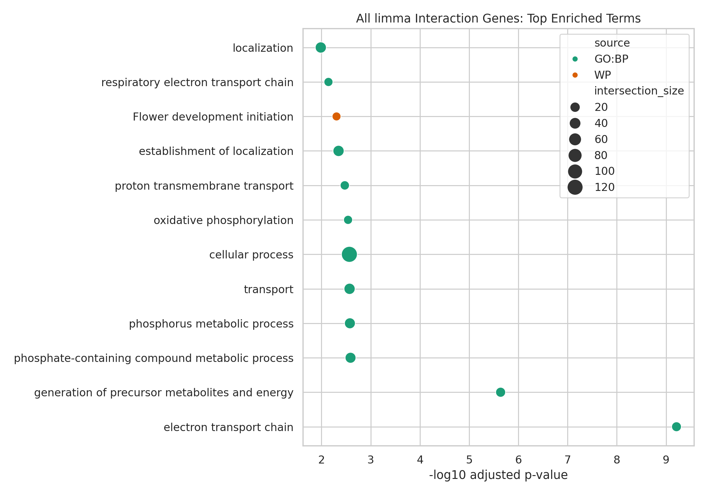
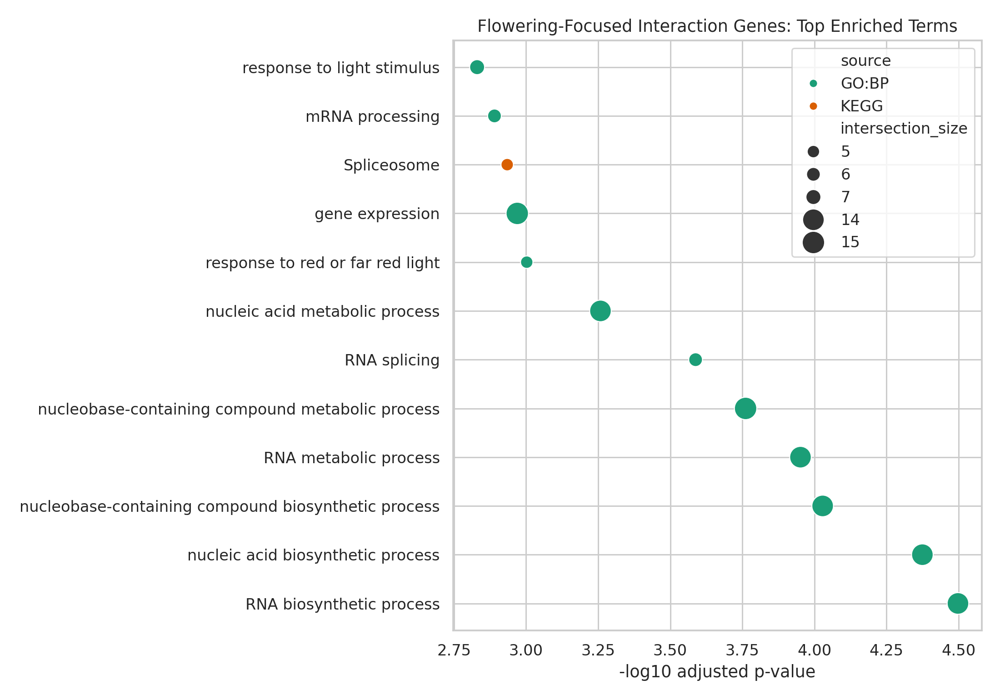

Ortholog-based enrichment analysis
================
JG
2026-04-08

## Purpose

- Give a clear summary of pathway enrichment from the limma interaction genes.
- Show the difference between the full interaction set and the flowering-focused subset.
- Point out the biology that looks most useful for next-step validation and marker work.

## Data and links

This report uses the ortholog-mapped enrichment files in `ortholog_enrichment_output`.

## Results and conclusions

1.  We found 698 significant interaction genes from the limma interaction model.
2.  Of those, 209 mapped to Arabidopsis-like orthologs (192 unique symbols) for the full-set enrichment.
3.  In the flowering-focused list, 22 genes mapped (21 unique symbols), with strong hits in light response and RNA processing.
4.  The full interaction set is mostly energy and transport biology, while the flowering-focused set leans more into photoperiod/light signaling and spliceosome-related control.

## Mapping summary

| Metric | Count |
|:--|--:|
| Significant limma interaction genes | 698 |
| Interaction genes mapped to orthologs | 209 |
| Unique ortholog symbols (all interactions) | 192 |
| Flowering-focused mapped genes | 22 |
| Unique ortholog symbols (flowering-focused) | 21 |

## Visualizations

### All significant interaction genes

### Flowering-focused interaction genes

## Top enriched terms: all interaction genes

| source | native | name | p_value | intersection_size | term_size |
|:--|:--|:--|--:|--:|--:|
| GO:BP | GO:0022900 | electron transport chain | 6.14e-10 | 15 | 193 |
| GO:BP | GO:0006091 | generation of precursor metabolites and energy | 2.30e-06 | 17 | 462 |
| GO:BP | GO:0006796 | phosphate-containing compound metabolic process | 2.57e-03 | 30 | 2025 |
| GO:BP | GO:0006793 | phosphorus metabolic process | 2.65e-03 | 30 | 2028 |
| GO:BP | GO:0006810 | transport | 2.69e-03 | 34 | 2477 |
| GO:BP | GO:0006119 | oxidative phosphorylation | 2.88e-03 | 5 | 40 |
| GO:BP | GO:1902600 | proton transmembrane transport | 3.36e-03 | 8 | 155 |
| WP | WP:WP2108 | Flower development initiation | 4.95e-03 | 3 | 17 |

## Top enriched terms: flowering-focused interaction genes

| source | native | name | p_value | intersection_size | term_size |
|:--|:--|:--|--:|--:|--:|
| GO:BP | GO:0032774 | RNA biosynthetic process | 3.18e-05 | 14 | 3395 |
| GO:BP | GO:0141187 | nucleic acid biosynthetic process | 4.22e-05 | 14 | 3470 |
| GO:BP | GO:0034654 | nucleobase-containing compound biosynthetic process | 9.36e-05 | 14 | 3690 |
| GO:BP | GO:0016070 | RNA metabolic process | 1.12e-04 | 14 | 3741 |
| GO:BP | GO:0008380 | RNA splicing | 2.58e-04 | 6 | 355 |
| GO:BP | GO:0009639 | response to red or far red light | 9.95e-04 | 5 | 242 |
| KEGG | KEGG:03040 | Spliceosome | 1.16e-03 | 5 | 205 |
| GO:BP | GO:0009416 | response to light stimulus | 1.48e-03 | 7 | 764 |

## Biological interpretation

### Full interaction set

- The top terms suggest cultivar-by-stage differences in core energy use and transport.
- In plain terms, flowering shifts are happening together with broad whole-plant physiology changes, and those changes depend on genotype.

### Flowering-focused subset

- The strongest signals are in RNA biosynthesis, RNA splicing, and light-response pathways.
- That pattern fits a model where flowering time differences come from how light cues are interpreted and then translated through transcript processing.

## Improvement

The enrichment is in Arabidopsis ortholog space with an Arabidopsis background. So this is best treated as directional biological guidance, and the top candidates still need hemp-specific validation before practical use.